1. #### 表的创建

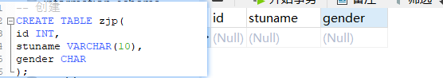

2. #### 查看表结构

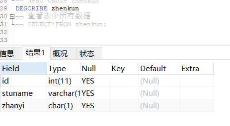

3. #### 查看表中所有数据 

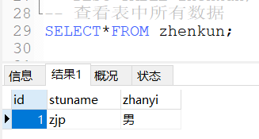

4. #### 往表中添加数据

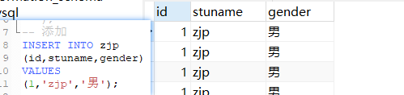

 

5. #### 修改表名

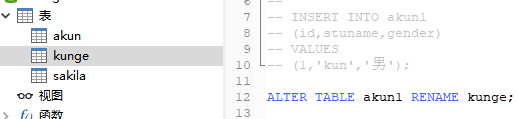

6. #### 修改列名

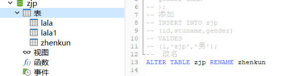

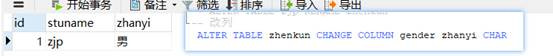

#### 7.基础查询

##### （1）.查询列表

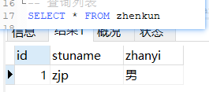

##### （2）.查询单个字段

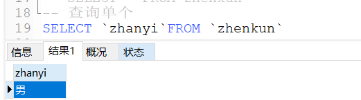

##### （3）查询多个字段

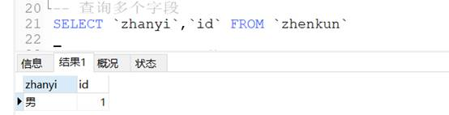

##### （4）查询函数

##### （5）起别名

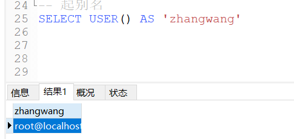