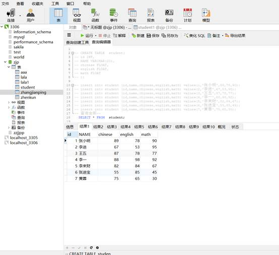

查询表中所有学生的信息

查询表中所有学生的姓名和对应的英语成绩

过滤表中重复数据（英语成绩）

使用别名表示学生分数

统计每个学生的总分

查询姓名为李一的学生成绩

查询英语成绩大于90分的同学

查询总分大于200分的所有同学

查询英语分数在 80－90之间的同学

查询数学分数为89,90,91的同学

查询所有姓李的学生英语成绩

查询数学成绩大于80并且语文成绩大于80的同学

查询英语成绩大于80或者总分是200的同学

对数学成绩排序(降序)后输出

对总成绩按从高到低的顺序输出

对姓李的学生总成绩按照从高到低的顺序输出

