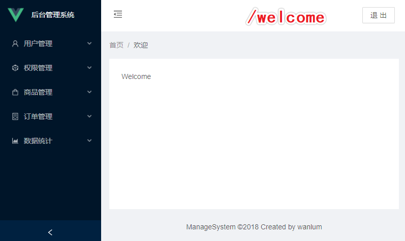
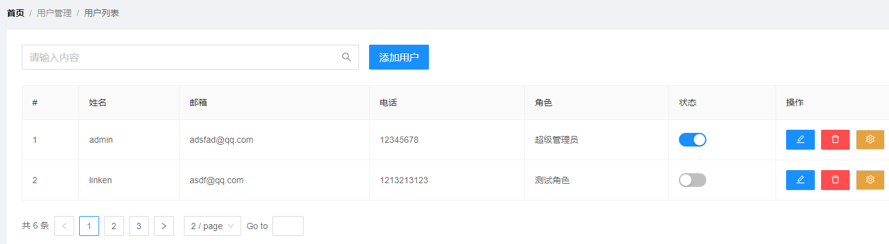
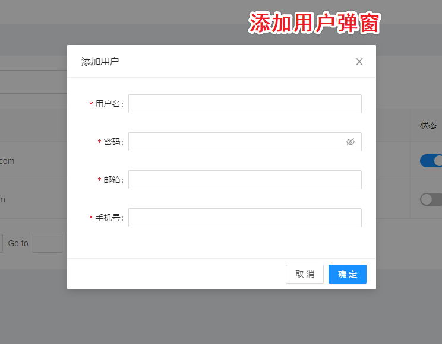

## 考核题

`要求：完成电商后台管理系统的登录/退出功能，侧边栏布局，用户列表(布局,数据渲染,分页,添加用户弹窗)等。`


### 考核相关提供

#### 文档网址

UI框架文档：https://2x.antdv.com/docs/vue/introduce-cn

登录页参照：https://preview.pro.antdv.com/user/login

侧边栏参照( `先登录` )：https://preview.pro.antdv.com/dashboard/workplace

Vue路由(`守卫`)文档：https://router.vuejs.org/zh


#### 二次封装axios

##### `config.js`

```js
// 设置基准地址 baseUrl
// 未来要可以配置
// 只要是导出的配置对象就可以
export const baseHost = {
  API1: {
    // 开发的基准地址
    dev_host: "http://www.wanlum.com:8888/api/private/v1/",
    // 线上的基准地址
    pro_host: "http://www.wanlum.me.8888:api/private/v1/"
  }
};
```

##### `featch.js`

```js
// axios 配置项

// 引入axios库
import axios from "axios";
// 创建 axios 实例
const instance = axios.create({
  // 返回数据类型
  responseType: "json",
  // 超时时间
  timeout: 7000,
  // 最大发包长度
  maxContentLength: 2000,
  // 重试次数
  retry: 3,
  // 重试延时，3秒重试一次
  retryDelay: 3000,
  // 重试条件，默认只要是错误都需要重试
  shouldRetry: () => true
});

// 3.声明请求拦截器()
// setRequestHeader("token","token之")
instance.interceptors.request.use(
  config => {
    // 在headers头上添加参数
    config.headers["Content-Type"] = "application/json;charset=UTF-8";
    const token = window.sessionStorage.getItem("token");
    // 判断是否有token令牌
    if (token) {
      config.headers["Authorization"] = token;
    }
    return config;
  },
  error => {
    return Promise.reject(error);
  }
);
// 4.声明响应拦截器
instance.interceptors.response.use(
  response => {
    const { status: code } = response.data.meta;
    // 这里可以对后端的一些状态码进行处理
    switch (code) {
      // 如果返回的状态码为200说明接口请求成功
      // 否则的话抛出错误
      case 200:
        return Promise.resolve(response);
      // 服务器状态码不是2开头的情况
      //  这里可以跟你们的后台开发人员协商好统一的错误状态码
      // 然后根据返回的状态码进行一些操作，例如登录过期提示，错误提示等等
      case 400:
        return Promise.resolve(response);
    }
  },
  error => {
    // 获取error对象的config属性
    const { config } = error;
    // 如果config不存在，或者retry选项没有设置，用reject
    if (!config || !config.retry) return Promise.reject(error);

    // 设置变量来跟踪重试次数
    config.__retryCount = config.__retryCount || 0;

    // 检查我们重试的次数是否超出最大重试次数
    if (config.__retryCount >= config.retry) {
      // 使用reject方法抛出错误
      Notification({
        title: "请求超时",
        message: "当前网络不佳，请稍后刷新重试"
      });

      return Promise.reject(error);
    }

    // 计算重试次数
    config.__retryCount += 1;
    // 创建一个新的Promise 来处理 exponential backoff
    let backoff = new Promise(function(resolve) {
      setTimeout(function() {
        resolve();
      }, config.retryDelay || 1);
    });

    // return the promise in which  recalls axios to retry the request
    return backoff.then(function() {
      return instance(config);
    });
  }
);

export default instance;
```

##### `http.js`

```js
/**
 * 封装GET、POST、PUT、DELETE方法
 */

// 引入config.js
import featch from "./featch";
import { baseHost } from "../../config";

//  开发环境 development  上线环境 production
const env = process.env.NODE_ENV;
let serverURL = "";

/**
 * @method getURL 获取请求地址
 *
 * @param {String} type [请求 地址环境类型]
 */
const getURL = type => {
  switch (env) {
    case "production":
      serverURL = baseHost[type].pro_host;
      break;
    case "development":
      serverURL = baseHost[type].dev_host;
      break;
    case "testing":
      serverURL = baseHost[type].test_host;
      break;
  }

  return serverURL;
};

/**
 * @method httpGet
 *
 * import { httpGet } from '@/utils/http';
 *
 * httpGet('', payload).then().catch();
 *
 * @param {*} url [ 请求地址 ]
 * @param {*} payload [ 请求参数 ]
 * @param {*} type [ 设置 baseURL ]
 */
export const httpGet = async (url, payload, type = "API1") => {
  try {
    serverURL = getURL(type);
    featch.defaults.baseURL = serverURL;
    const response = await featch.get(`${url}`, {
      params: payload
    });

    const result = response.data;
    return result;
  } catch (err) {
    throw new Error(err);
  }
};

/**
 * @method httpPost
 *
 * import { httpPost } from '@/libraries/axios/http'
 *
 * httpPost('', payload).then().catch()
 *
 * @param { String } url  [ 请求地址 ]
 * @param { Object } payload  [ 请求参数 ]
 */
export const httpPost = async (url, payload, type = "API1") => {
  try {
    serverURL = getURL(type);

    featch.defaults.baseURL = serverURL;

    const response = await featch.post(`${url}`, payload);

    const result = response.data;
    return result;
  } catch (err) {
    throw new Error(err);
  }
};

/**
 * @method httpPut
 *
 * import { httpPut } from '@/utils/http'
 *
 * httpPut('', payload).then().catch()
 *
 *
 * @param {*} url [ 请求地址 ]
 * @param {*} payload [ 请求参数 ]
 * @param {*} type [ 设置 baseURL ]
 */
export const httpPut = async (url, payload, type = "API1") => {
  try {
    serverURL = getURL(type);
    featch.defaults.baseURL = serverURL;
    const response = await featch.put(`${url}`, payload);

    const result = response.data;
    return result;
  } catch (err) {
    throw new Error(err);
  }
};

/**
 * @method httpDelete
 *
 * import { httpDelete } from '@/utils/http'
 *
 * httpDelete('', payload).then().catch()
 *
 * @param {*} url [ 请求地址 ]
 * @param {*} payload [ 请求参数 ]
 * @param {*} type [ 设置 baseURL ]
 */
export const httpDelete = async (url, payload, type = "API1") => {
  try {
    serverURL = getURL(type);
    featch.defaults.baseURL = serverURL;
    const response = await featch.delete(`${url}`, {
      data: payload
    });

    const result = response.data;
    return result;
  } catch (err) {
    throw new Error(err);
  }
};
```

##### `api / index.js`

```js
// 需要自己根据需求，书写接口
```


#### 图标icon

`如有纰漏or不想要，请自行查找✔`

```js
用户管理: UserOutlined
二级导航: AppstoreOutlined
展开侧边栏: MenuUnfoldOutlined
收缩侧边栏: MenuFoldOutlined
权限管理: CodeSandboxOutlined
商品管理: ShoppingOutlined
订单管理: ContainerOutlined
数据统计: AreaChartOutlined
编辑: EditOutlined
删除: DeleteOutlined
设置: SettingOutlined
```


#### 效果图参考

##### `/welcome`




##### `/users`






### 考核需求

- 校验登录功能  `无token必须先登录`
- 退出功能
- `/home` 布局
- `/welcome` 布局
- `/users` 布局
- 分页功能
- 点击`添加用户`后弹窗  `无添加功能`


###### 


##### 问题咨询

如有疑问：`立即咨询 ` ~~`110`~~ `学委`


