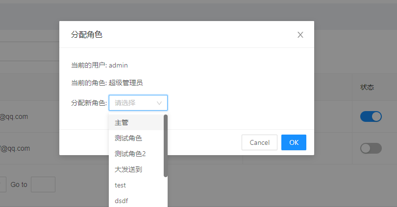

## 考核题

`要求：完成电商后台管理系统的用户操作(增删改查)、权限列表、角色列表(下拉,添加)等。`


### 考核相关提供

#### 文档网址

UI框架文档：https://2x.antdv.com/docs/vue/introduce-cn


#### 图标icon

`如有纰漏or不想要，请自行查找✔`

```js
编辑: EditOutlined
删除: DeleteOutlined
设置: SettingOutlined
警告: ExclamationCircleOutlined
右展开: CaretRightOutlined
```


#### 效果图参考

- ##### `添加用户`

  

- ##### `删除用户`

  

- ##### `编辑用户`

  

- ##### `分配角色`

  

- ##### `权限列表`

  

- ##### `角色列表`

  

- ##### 添加角色

  


### 考核需求

- ##### 用户列表页

  - ###### 添加用户

  - ###### 删除用户

  - ###### 编辑用户

  - ###### 分配角色

  - ###### 修改用户状态

- ##### 权限列表页

  - ###### 布局渲染

- ##### 角色列表页

  - ###### 布局渲染

  - ###### 下拉功能+渲染

  - ###### 添加角色


##### 问题咨询

如有疑问：`立即咨询 ` ~~`110`~~ `学委`


