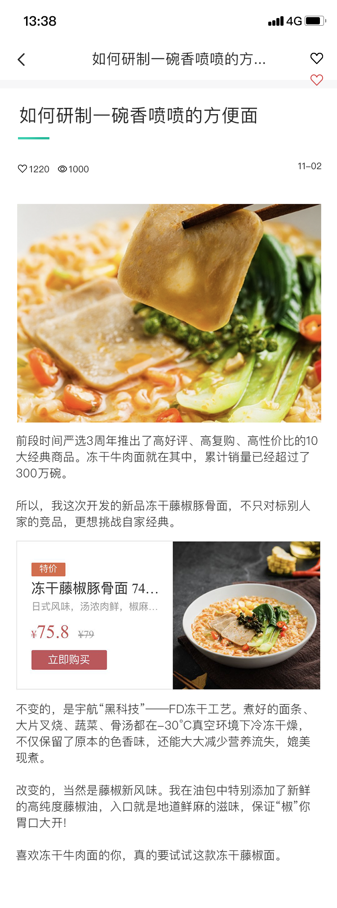

## 考核题

`完成提供的专题页和查看页`


### 一、考核相关提供

#### 1、摹客账号

```js
zh：295386487@qq.com
mm：yang295386487
```

#### 2、页面网址

专题页：https://app.mockplus.cn/app/7KVM9Cek8jq/specs/design/VFQZCHtne

查看页：https://app.mockplus.cn/app/7KVM9Cek8jq/specs/design/O7En89Va1KS

#### 3、图片素材

>  素材图放至在images文件夹，图片是UI提供的切图(`未提供的请自供`)，文件名自拟，考核时备好即可。

#### 4、效果图

- ##### `专题页`

   
  
- ##### `查看页`

   
  
  


### 二、考核需求

- ##### 专题页

  - ###### 页面布局

  - ###### 轮播图功能 (`图片自供`)

  - ###### 点击 `如何研制..方便面?` 跳转至查看页

- ##### 查看页

  - ###### 页面布局

  - ###### 有返回上一页图标(点击可返回专题页)


##### 问题咨询

如有疑问：`立即咨询 ` ~~`110`~~ `学委`


